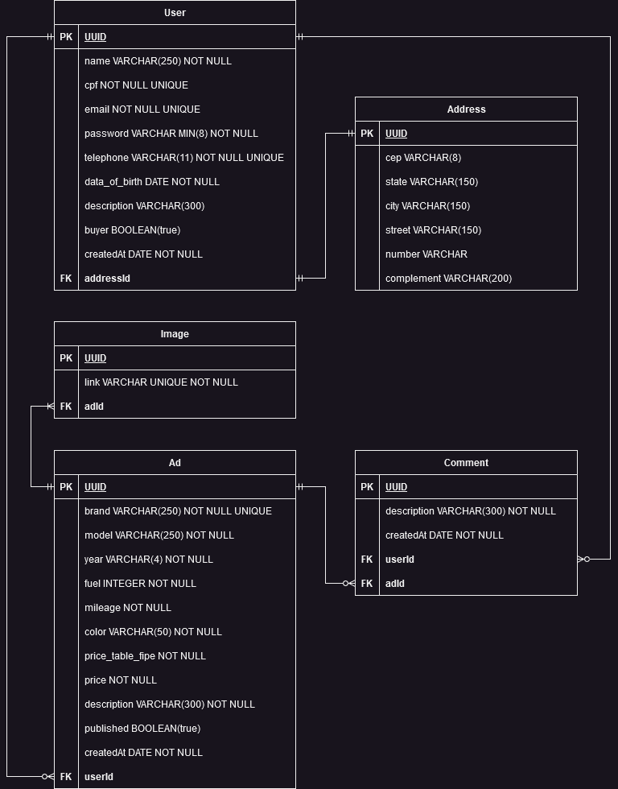

# Documentação da API

## Tabela de Conteúdos

- [Visão Geral](#1-visão-geral)
- [Diagrama ER](#2-diagrama-er)
- [Início Rápido](#3-início-rápido)
    - [Instalando Dependências](#31-instalando-dependências)
    - [Variáveis de Ambiente](#32-variáveis-de-ambiente)
    - [Migrations](#33-migrations)
- [Sobre](#4-sobre)
-[Autores](#5-autores)
-[Licença](#6-licença)

---

## 1. Visão Geral

Visão geral do projeto, um pouco das tecnologias usadas.

- [NodeJS](https://nodejs.org/en/)
- [Express](https://expressjs.com/pt-br/)
- [TypeScript](https://www.typescriptlang.org/)
- [PostgreSQL](https://www.postgresql.org/)
- [TypeORM](https://typeorm.io/)
- [Zod](https://zod.dev/)

A URL base da aplicação:

https://testetecnico-simbiox.onrender.com/

Documentação da API:

https://kenzie-kars-api.onrender.com/docs/


---

## 2. Diagrama ER
[ Voltar para o topo ](#tabela-de-conteúdos)


Diagrama ER da API definindo bem as relações entre as tabelas do banco de dados.



---

## 3. Início Rápido
[ Voltar para o topo ](#tabela-de-conteúdos)


### 3.1. Instalando Dependências

Clone o projeto em sua máquina e instale as dependências com o comando:

```shell
yarn
```

### 3.2. Variáveis de Ambiente

Em seguida, crie um arquivo **.env**, copiando o formato do arquivo **.env.example**:
```
cp .env.example .env
```

Configure suas variáveis de ambiente com suas credenciais do Postgres e uma nova database da sua escolha.

### 3.3. Migrations

Execute as migrations com o comando:

```
yarn typeorm migration:run -d src/data-source.ts
```

## 4. Sobre

Projeto desenvolvido durante o Módulo 6 da Turma 14 do curso de Desenvolvimento Full Stack da Kenzie Academy Brasil. Trata-se de uma API onde é possível registrar e cadastrar dois tipos de usuários (anunciante e comprador), onde o anunciante pode realizar o cadastro de anúncio, com funções específicas como editar, alterar e excluir. O usuário comprador terá acesso aos anúncios podendo efetuar a compra ou não.

## 5. Autores
Gabriel de Lima Santana
José Orlando de Carvalho Júnior
Leonardo Miranda
Ygor Rupp

## 6. Licença
Este projeto é Open Source para fins educacionais e não comerciais, Tipo de Licença - MIT
